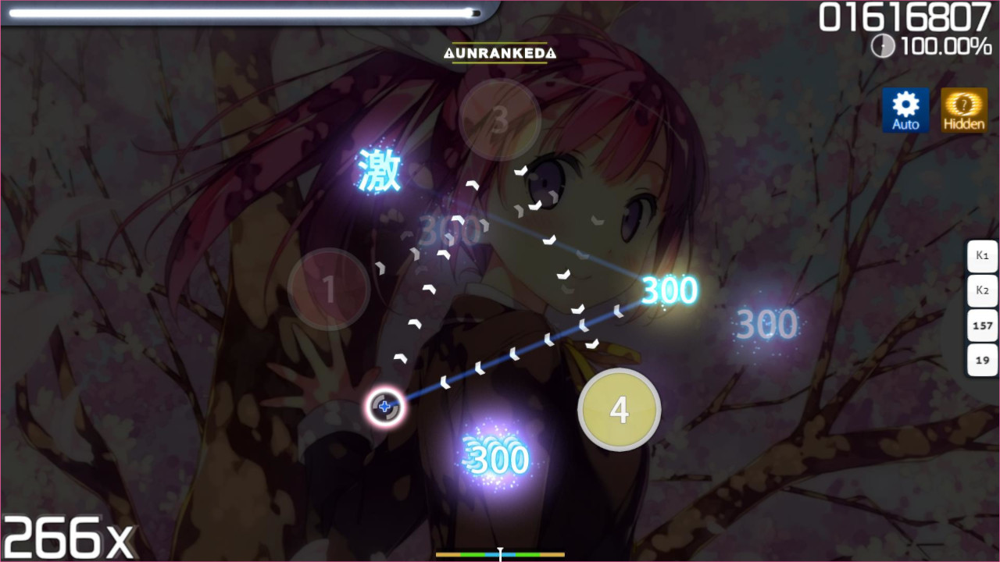
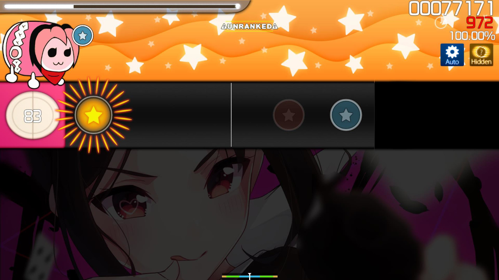

# Le mod Hidden

")

*Pour la liste complète de tous les mods, voir : [modificateurs de jeu](/wiki/Game_modifier)*\
*À ne pas confondre avec les mods [Fade In](/wiki/Game_modifier/Fade_In) et [Flashlight](/wiki/Game_modifier/Flashlight)*

## À propos

- Abréviation : HD
- Type : Difficulté croissante
- Multiplicateur de score :
  - ![][osu!] ![][osu!taiko] ![][osu!catch]: 1.06x
  - ![][osu!mania]: 1.00x
- Touche de raccourci par défaut : `F`
  - Touche de raccourci par défaut ([osu!mania](/wiki/Game_mode/osu!mania)) : `F` `F` ou `Shift`+`F`
- Légende :
  - ![][osu!]: `Jouez sans cercles d'approche et avec des notes qui s'estompent progressivement.`
  - ![][osu!taiko]: `Les notes s'estompent progressivement.`
  - ![][osu!catch]: `Jouez sans cercles d'approche et avec des notes qui s'estompent progressivement.`
  - ![][osu!mania]: `Les notes s'estompent progressivement.`
- Modes de jeu compatibles : ![][osu!] ![][osu!taiko] ![][osu!catch] ![][osu!mania]
- Variante (osu!mania) : [Fade In](/wiki/Game_modifier/Fade_In)

## Description

Le mod **Hidden** est un [modificateur de jeu](/wiki/Game_modifier) qui augmente la difficulté des beatmaps en supprimant les cercles d'approche et en faisant disparaître les [objets](/wiki/Hit_object) après leur apparition à l'écran.

### osu!

Dans le mode [osu!](/wiki/Game_mode/osu!), le mod Hidden élimine les cercles d'approche et fait disparaître les objets peu après leur apparition, ce qui oblige les joueurs à mémoriser plus ou moins le timing et, dans une moindre mesure, le placement et la trajectoire du slider.

Bien qu'il faille noter que le mod Hidden est considéré comme le mod d'augmentation de la difficulté le plus facile parmi les meilleurs joueurs en raison de la cohérence du moment où les objets apparaissent et disparaissent. En raison de cette cohérence, il est tout à fait possible d'apprendre à toucher les objets en se basant uniquement sur le moment où ils disparaissent.

### osu!taiko

Dans le mode [osu!taiko](/wiki/Game_mode/osu!taiko), les notes disparaissent à la moitié de l'écran, ce qui oblige les joueurs à se souvenir du timing et de la couleur. Cependant, les sliders et les dendens traversent toujours la timeline complète et ne s'éteignent pas, à la condition que le denden n'ait pas de cercle d'approche pour indiquer quand il s'éteint.

Sur les beatmaps présentant une difficulté générale élevée, le mod Hidden est utilisé par les joueurs expérimentés pour augmenter le score au lieu du mod [Hard Rock (HR)](/wiki/Game_modifier/Hard_Rock) car le HR rend parfois la fenêtre de timing trop petite.

Contrairement à osu!, le mod Hidden est généralement considéré comme beaucoup plus difficile à lire ou à "s'habituer", car il oblige le joueur à mémoriser la couleur suivante.

### osu!catch

Dans le mode [osu!catch](/wiki/Game_mode/osu!catch), le mod Hidden fait disparaître les fruits à la moitié de l'écran.

Les effets sur la difficulté d'osu!catch concernant l'utilisation du mod Hidden varient d'une beatmap à l'autre, mais il est généralement considéré que les beatmaps avec un [approach rate (AR)](/wiki/Beatmapping/Approach_rate) de 9 ou plus n'ont qu'une augmentation de difficulté très faible.

### osu!mania

Dans le mode [osu!mania](/wiki/Game_mode/osu!mania), le mod Hidden fonctionne comme l'inverse du mod Fade In, car les notes s'effacent avant que vous ne soyez censé les frapper.

, à 326x combo (en haut au milieu), à 516x combo (en haut à droite/en bas à gauche), et à 900x combo (en bas à droite) dans osu!mania")

## Le saviez-vous ?

- Le mod Hidden est apparu pour la première fois dans Ouendan 2, qui était le deuxième jeu DS japonais de la série [Osu! Tatakae! Ouendan](https://fr.wikipedia.org/wiki/Osu!_Tatakae!_%C5%8Cendan) (la série dont osu! s'inspire).
- Si une beatmap est passée avec un grade S ou SS avec le mod Hidden activé, la beatmap attribuera la variante argentée du grade à la place.
- Par défaut, dans [osu!](/wiki/Game_mode/osu!) le [approach circle](/wiki/Hit_object/Approach_circle) du premier [objet](/wiki/Hit_object) sera temporairement visible au début d'une beatmap afin d'aider les joueurs à mieux évaluer le moment où ils doivent toucher l'objet en question. Ceci peut être désactivé dans les options sous `Gameplay`.
- Dans le mode osu!mania, le mod Hidden est une variante du mod [Fade In](/wiki/Game_modifier/Fade_In).
- La version actuelle du mod Hidden dans osu!mania était auparavant un mod séparé appelé [Fade Out](/wiki/Game_modifier/Fade_Out).

[osu!]: /wiki/shared/mode/osu.png "osu!"
[osu!taiko]: /wiki/shared/mode/taiko.png "osu!taiko"
[osu!catch]: /wiki/shared/mode/catch.png "osu!catch"
[osu!mania]: /wiki/shared/mode/mania.png "osu!mania"
