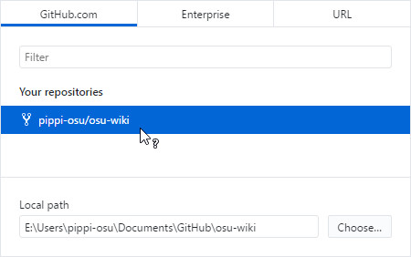
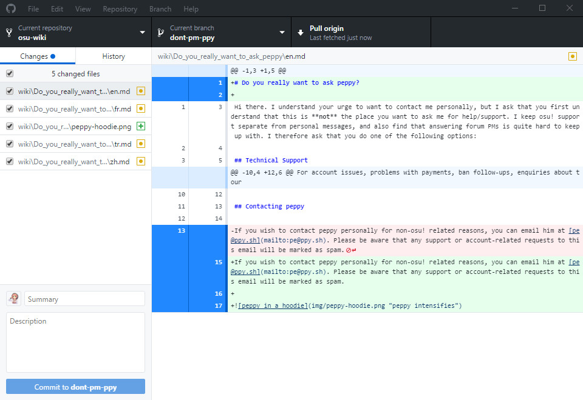

# GitHub Desktop

*Эта статья является продолжением основного руководства* и описывает работу с [GitHub Desktop](https://desktop.github.com). **Помимо него, вы можете использовать и другие клиенты git.** Тем не менее, вам потребуется заходить на GitHub для создания пулл-реквестов и публикации своих изменений.

## Установка

1. Скачайте и установите [GitHub Desktop](https://desktop.github.com).
2. После завершения установки, когда GitHub Desktop попросит залогиниться, нажмите на ссылку `Sign in to GiHub.com`.
3. Заполните все необходимые поля.
4. Переходите к [клонированию репозитория](#клонирование).

## Клонирование

1. Нажмите на кнопку `Clone a repository`.

2. В списке принадлежащих вам репозиториев выберите форк `osu-wiki`.

3. Выберите, куда скачать репозиторий, и не забудьте его местоположение.

   

4. Нажмите на кнопку `Clone` и подождите, пока репозиторий склонируется.

5. Переходите к [созданию новой ветки](#создание-новой-ветки).

## Создание новой ветки

Каждое изменение (например, перевод одной статьи или мелкие одинаковые правки в нескольких статьях) стоит разрабатывать в отдельной ветке. У этого подхода есть [несколько важных преимуществ](https://bitworks.software/2018-12-10-git-feature-branch-workflow.html):

- Разные по смыслу изменения изолированы друг от друга;
- При включении изменений в основной репозиторий, а также при обновлении вашей ветки, вы будете намного реже сталкиваться с [конфликтами](/wiki/osu!_wiki/Contribution_guide/Best_practices#resolving-conflicts).

1. Нажмите на пункт `Current branch` в верхнем меню.

2. Придумайте название для новой ветки. Рекомендуется выбирать название, исходя из сути изменений; например, ветку, где вы переводите критерии ранкинга, можно назвать `ru-ranking-criteria-1`.

   

3. Переходите к [редактированию](#редактирование).

## Редактирование

1. Откройте директорию, куда вы склонировали репозиторий, и перейдите к файлу, который хотите отредактировать. Файлы сгруппированы следующим образом: название директории означает название статьи, к которой относится содержимое, а внутри расположены переводы на разные языки, имеющие расширение `.md`.
2. Откройте нужный файл в вашем любимом текстовом редакторе.
3. При внесении правок следуйте [критериям оформления статей](/wiki/Article_styling_criteria), насколько это возможно.
4. [Сделайте коммит](#коммит-и-выгрузка-изменений), чтобы сохранить изменения.

### Перемещение файлов

1. Переносите и переименовывайте файлы, как вы это обычно делаете.
2. [Сделайте коммит](#коммит-и-выгрузка-изменений), чтобы сохранить изменения.

### Создание файлов

*Внимание: если вы создаёте файлы через Проводник Windows, включите [отображение расширений файлов](http://setupwindows.ru/windows/kak-otobrazit-rasshirenie-fajlov#windows10).*

1. В зависимости от типа файла, используйте удобный вам инструмент: Проводник Windows, текстовый или графический редактор. При создании перевода статьи используйте для имени файла [сокращённое название локали](/wiki/Article_styling_criteria#локали) (`ru` для русского языка).
2. [Сделайте коммит](#коммит-и-выгрузка-изменений), чтобы сохранить изменения.

### Удаление файлов

1. Удалите файл(ы) через Проводник Windows.
2. [Сделайте коммит](#коммит-и-выгрузка-изменений), чтобы сохранить изменения.

## Коммит и выгрузка изменений

Коммитом в терминологии git и GitHub называется набор связанных изменений. Делая коммит, вы сохраняете свои наработки и подготавливаете их к выгрузке на сервер.

1. Откройте GitHub Desktop. Его окно будет выглядеть как-то так:

   

2. По умолчанию GitHub Desktop предлагает сделать коммит со всеми изменениями.

3. Если у вас есть несколько изменений, разных по смыслу, рекомендуется сделать по коммиту на каждое.

Так, на скриншоте выше [pippi](/wiki/Mascots#-pippi) добавила изображение, включила его в `en.md` и пометила переводы как устаревшие. Эти действия можно разделить на два коммита: первый — с добавлением изображения и правкой `en.md`, второй — с пометкой переводов.

4. Выберите файлы, которые попадут в коммит.

5. Придумайте для коммита краткое описание **на английском языке** не длиннее 72 символов.

6. К коммиту можно по желанию добавить более подробное описание, его длина, как и выбранный язык, не ограничены.

   

7. Нажмите на синюю кнопку `Commit to` и, если требуется, сделайте оставшиеся коммиты (шаги 4–7).

   

8. Когда все изменения закоммичены, нажмите на кнопку `Publish branch`, расположенную наверху.

   

9. Переходите к [публикации изменений](/wiki/osu!_wiki/Contribution_guide#публикация-изменений).
